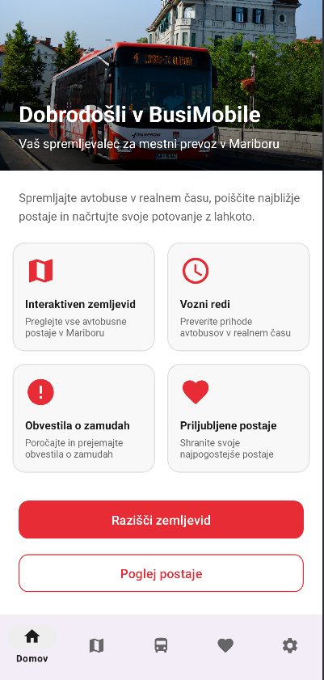

# Flow

Kotlin Flow je API za obdelavo tokov podatkov, ki je del knjižnice `kotlinx.coroutines`. Omogoča asinhrono obdelavo zaporedij vrednosti, ki prihajajo postopoma. V bistvu obravnavamo podatke, ki se oddajajo skozi čas. Tako temelji na vzorcu proizvajalec–potrošnik.
Proizvajalec je lahko podatkovna baza, API klici, podatki s senzorjev itd. Potrošnik je lahko UI, ViewModel itd. Flow skrbi za varen asinhron prenos podatkov med proizvajalcem in potrošnikom.

Flow sledi principu "cold stream", kar pomeni, da se tok podatkov ne začne izvajati, dokler se nanj ne naročimo (collect). To omogoča učinkovito upravljanje z viri.

---

## Zakaj Flow? Prednosti?
1. **Integracija s korutinami:** Flow je razširitev Kotlin Coroutines, kar pomeni, da lahko izkoristimo vse prednosti sočasnosti, ki jih Kotlin ponuja. Ni ročnega upravljanja z nitmi. 
2. **Podpora v Android ekosistemu:** Flow je priporočen pristop za reaktivno programiranje v Android aplikacijah in je tesno integriran z Jetpack komponentami (ViewModel, Lifecycle itd.).
3. **Backpressure podpora:** Flow samodejno upravlja backpressure, kar pomeni, da proizvajalec ne more prehiteti porabnika.
4. **Bogastvo operatorjev:** Flow ponuja obsežen nabor operatorjev za transformacijo, filtriranje in kombiniranje tokov (map, filter, flatMapConcat, combine, zip itd.).
5. **Uporabniško prijetna sintaksa:** V primerjavi z *RxJava* je sintaksa Flow bistveno bolj berljiva.


## Slabosti

| Slabost | Opis |
|----------|------|
| **Učna krivulja** | Zahteva razumevanje korutin in asinhronega programiranja |
| **Debugging** | Sledenje napakam v asinhronih tokovih je lahko zahtevnejše |
| **Hot streams** | Za hot streams je potrebna uporaba SharedFlow ali StateFlow, kar doda kompleksnost |
| **Migracija** | Obstoječi projekti z RxJava zahtevajo postopno migracijo |

---

## Licenca

Kotlin Flow je del Kotlin standardne knjižnice in modula *kotlinx.coroutines* ter je licenciran pod Apache License 2.0.

Prosta uporaba: Uporaba za osebne, komercialne ali izobraževalne namene
Odprto-kodnost: Kodo lahko spreminjamo in prilagajamo brez omejitev

GitHub repozitorij: https://github.com/Kotlin/kotlinx.coroutines

---

## Število uporabnikov
Kotlin Flow uporablja velika večina Android razvijalcev, ki delajo z novejšimi projekti. Kotlinx.coroutines repozitorij, katerega del je Kotlin Flow, ima preko 13.000 zvezdic na GitHubu in več kot 100 milijonov prenosov mesečno preko Maven Central. Flow postaja standarden način za reaktivno programiranje v Kotlin/Android ekosistemu.

Podjetja, ki uporabljajo Flow: Google, JetBrains, Square, Netflix, Uber in številna druga.

--- 

## Ocenitev časovne/prostorske zahtevnosti
| Operacija | Časovna zahtevnost |
|----------|------|
| **emit()** | O(1) |
| **collect()** | O(n), kjer je n število emitiranih elementov |
| **map/filter** | O(n) |
| **combine (dva toka)** | O(n + m) |
| **flatMapConcat** | O(n + m) |

Flow operacije so optimizirane in se izvajajo asinhrono, kar pomeni, da ne blokirajo glavne niti.

Kotlin Flow je zelo lahek. Kotlinx.coroutines knjižnica doda približno 1.5 MB k velikosti APK.

| Komponenta | Velikost |
|----------|------|
| **kotlinx-coroutines-core** | ~1.5 MB (pred optimizacijo) |
| **kotlinx-coroutines-android** | ~100 KB |


---

## Vzdrževanje

#### Razvojna ekipa
Flow vzdržuje JetBrains kot del Kotlin ekosistema, s prispevki Googlovih inženirjev in odprtokodne skupnosti. 

Posodobitve prihajajo mesečno ali pa vsako četrtletje. 

Repozitoij ima več kot 200+ ljudi, ki so prispevali k razvoju.

---

## Primer uporabe

```kotlin
dependencies {
    implementation("org.jetbrains.kotlinx:kotlinx-coroutines-core:1.8.1")
    implementation("org.jetbrains.kotlinx:kotlinx-coroutines-android:1.8.1")
}
```

Prikaz osnovnega primera:

```kotlin
fun main() = runBlocking {

    // osnoven flow blok
    val simpleFlow = flow {
        emit(1)
        emit(2)
        emit(3)
    }

    // preprosto zbiranje podatkov iz flowa
    simpleFlow.collect { value ->
        println(value)
    }
}
```

V spodnji funkciji sem web socket ovil v flow blok, da lahko neprekinjen tok sporočil obravnavam kot asinhroni tok podatkov.

Uporabil sem callbackFlow, saj WebSocket temelji na callbackih. Vsako prejeto sporočilo iz WebSocketa postane nova vrednost v Flow-u.

Ko se WebSocket odpre, se povezava inicializira, ob vsakem prejetem sporočilu pa podatke s pomočjo trySend() oddam v Flow. Potrošnik lahko te podatke nato neprestano bere z uporabo collect().

V primeru napake ali zaprtja web socketa flow zaprem, s čimer zagotovim, da se tok podatkov pravilno zaključi.

```kotlin
// flow builder
fun webSocketFlow(url: String): Flow<String> = callbackFlow {

    val client = OkHttpClient()

    val request = Request.Builder()
        .url(url)
        .build()

    val listener = object : WebSocketListener() {

        override fun onOpen(webSocket: WebSocket, response: Response) {
            println("WebSocket opened")
        }

        override fun onMessage(webSocket: WebSocket, text: String) {
            // novo sporočilo oddamo v flow
            trySend(text)
        }

        override fun onFailure(
            webSocket: WebSocket,
            t: Throwable,
            response: Response?
        ) {
            close(t)
        }

        override fun onClosed(webSocket: WebSocket, code: Int, reason: String) {
            close()
        }
    }

    val webSocket = client.newWebSocket(request, listener)

    // on prekinitvi web socketa flow zaprem
    awaitClose {
        webSocket.close(1000, "Flow cancelled")
        println("WebSocket closed")
    }
}
```

V tej funkciji pa sem ustvaril potrošnika za flow, ki prejema podatke iz web socketa.
Nato sem flow, vrnjen iz webSocketFlow, prebral s pomočjo collect(), kar pomeni, da se program stalno naroča na nove podatke in jih izpisuje v konzolo.
Vsako novo sporočilo iz iz web socketa se tako takoj obdeluje in prikaže, kar omogoča enostaven realno-časovni nadzor nad tokom podatkov.

```kotlin
fun main() = runBlocking {

    val socketFlow = webSocketFlow("wss://example.com/coordinates")

    socketFlow.collect { message ->
        println("Prejel podatek: $message")
    }
}
```

---

## Prikaz v aplikaciji


---


